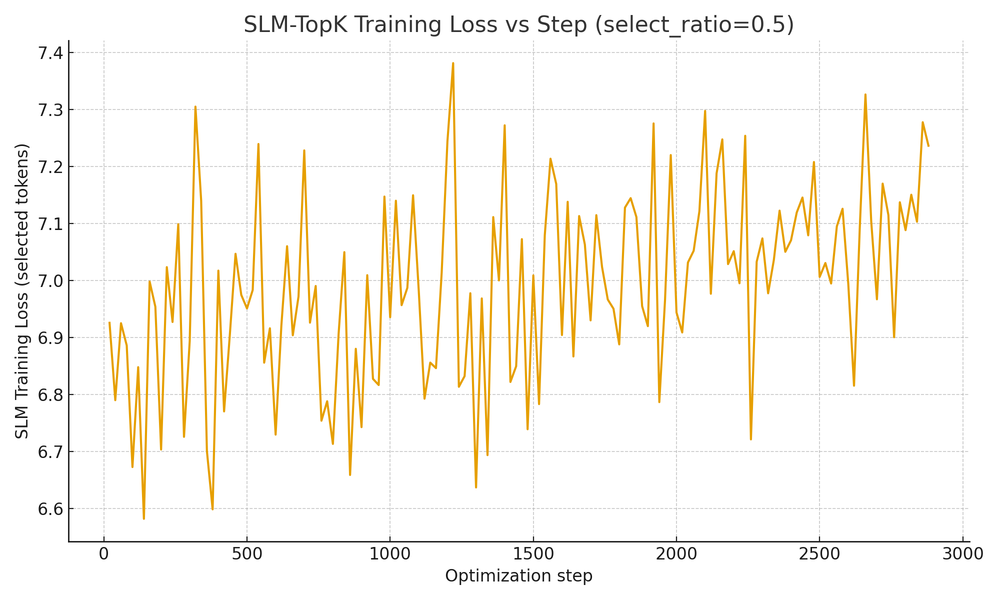
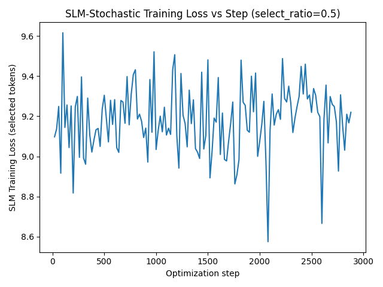
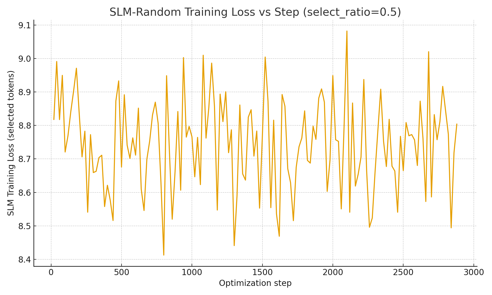
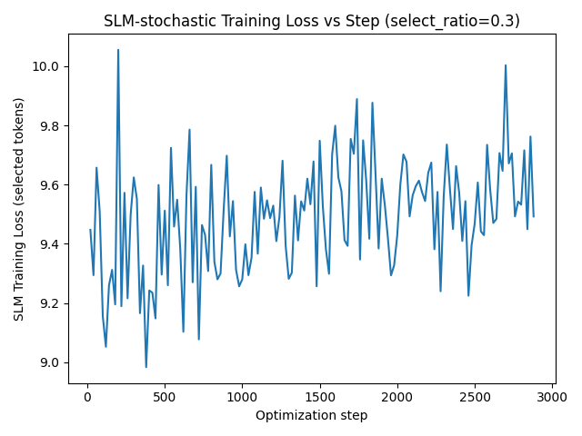
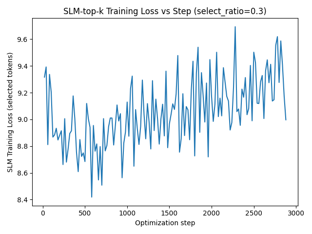
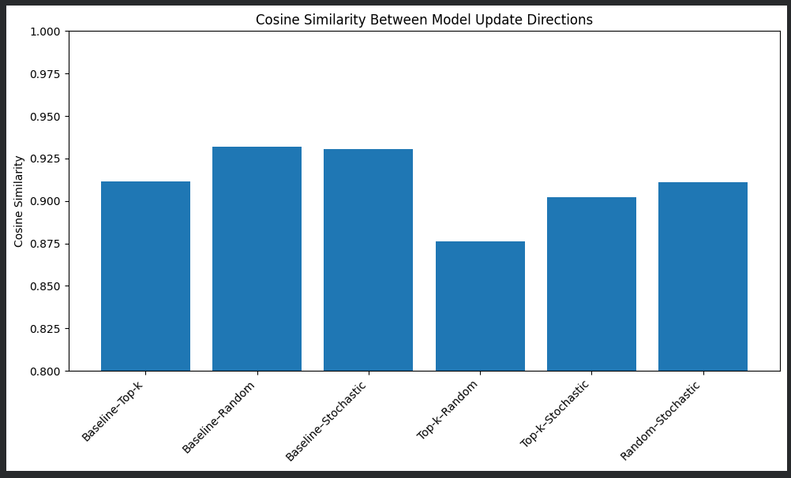

# Selective Language Modeling (SLM) — TinyLlama-1.1B Replication

This project reproduces the core empirical results from the NeurIPS 2024 paper **“Not All Tokens Are What You Need for Pretraining”** using **TinyLlama-1.1B** on a single consumer GPU.

We evaluate:

- **Baseline CLM training**
- **Top-k SLM**
- **Random SLM**
- **Stochastic SLM**

across selection ratios **r = 0.5** and **r = 0.3**, along with:

- Token bucket movement (H→L, L→H)
- Validation perplexity
- Cosine similarity between LoRA update directions

This produces a compact, faithful replication of the paper’s key findings.

---

## 📌 Baseline CLM Training (Full Tokens)

Serves as the reference model (100% token usage).

### Baseline Training Loss Curve

**Final validation perplexity:** ≈ **9.89**

---

# 🔍 Results — Select Ratio **r = 0.5**

## Top-k SLM (r = 0.5)

**Observations:**
- Validation ppl ≈ **11.40**
- Worst performer
- Highly unstable
- Confirms paper: **hard selection harms performance**

---

## Stochastic SLM (r = 0.5)

**Observations:**
- Validation ppl ≈ **10.04**
- Closest to baseline
- Soft preference for high-loss tokens → stable

---

## Random SLM (r = 0.5)

**Observations:**
- Validation ppl ≈ **10.05**
- Nearly identical to stochastic
- Strong evidence of **token redundancy**

---

# 🔍 Results — Select Ratio **r = 0.3**

## Stochastic SLM (r = 0.3)

**Observations:**
- More noise (fewer tokens)
- Still stable and effective
- Shows SLM holds up even at 30% token usage

---

## Top-k SLM (r = 0.3)

**Observations:**
- Noisy but structured
- Worse than stochastic at same ratio
- Still confirms difficulty-targeting behavior

---

# 📊 Token Bucket Transition Analysis (H→L / L→H)

Tokens are bucketed using the **baseline 70% loss quantile**.

### Interpretation:

- **Top-k:**
  - Highest **L→H** regressions (bad)
  - Confirms overfitting to difficult tokens

- **Random:**
  - Moves tokens without pattern
  - Neutral but stable

- **Stochastic:**
  - Highest **H→L** improvements
  - Lowest **L→H** regressions
  - Best stability  
  - Matches paper’s motivation for **soft selection**

---

# 📐 LoRA Update Cosine Similarity

Cosine similarity measures how close the update direction is to baseline CLM.

Higher = more similar to CLM training behavior.

## Cosine Similarity vs Baseline LoRA

| Comparison | Cosine |
|-----------|--------|
| Baseline ↔ Top-k | **0.9116** |
| Baseline ↔ Random | **0.9317** |
| Baseline ↔ Stochastic | **0.9304** |

➡ **Random & Stochastic** remain closest to baseline.  
➡ **Top-k** diverges the most → explains poor validation loss.

---

## Cosine Similarity Between SLM Variants

| Comparison | Cosine |
|-----------|--------|
| Top-k ↔ Random | 0.8763 |
| Top-k ↔ Stochastic | 0.9020 |
| Random ↔ Stochastic | **0.9109** |

Random ↔ Stochastic is highest → both behave as “soft CLM”.

---

# 🏁 Final Replication Findings

## ✔ Token redundancy is real  
Using **50% of tokens** increases perplexity by only **~1.5%**.

## ✔ Stochastic SLM is the most stable  
Closest to baseline in:
- Perplexity  
- Token bucket behavior  
- Cosine similarity  

## ✔ Top-k selection is harmful  
Deterministic hard selection hurts quality and stability.

## ✔ Training direction preserved under Random/Stochastic  
LoRA cosine similarities confirm close alignment with CLM.

## ✔ This project successfully reproduces the NeurIPS 2024 paper’s main claims  
All trends match the behaviors described in the SLM/RHO-1 paper.
